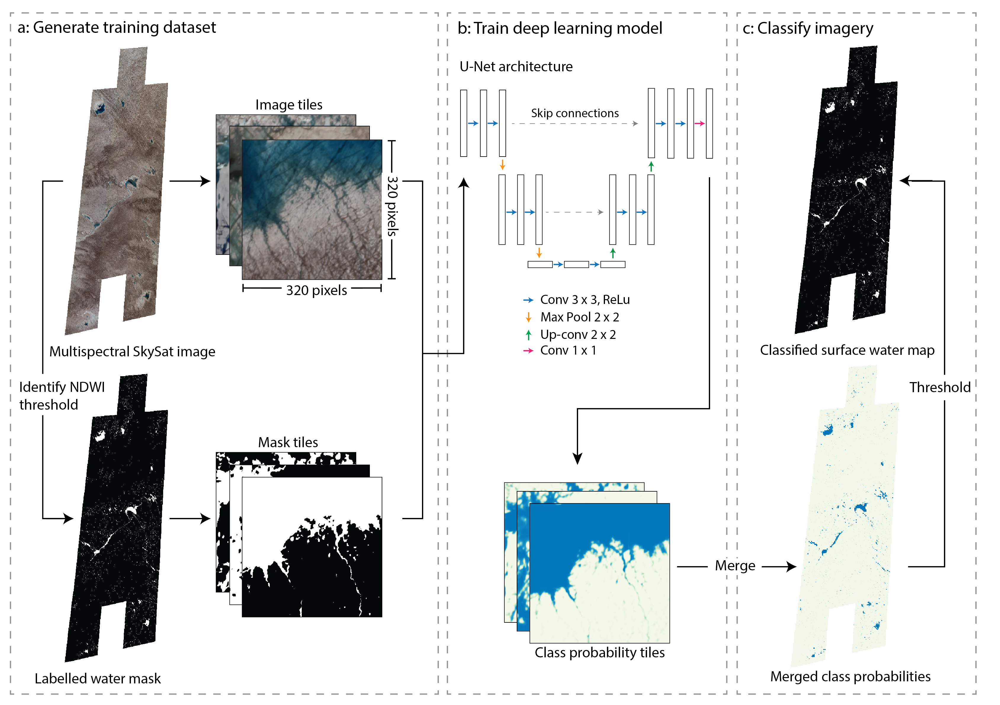

# Mapping meltwater on the Greenland Ice Sheet using deep learning and SkySat imagery

This repository contains the code and data references for the article:

> Ryan, J. C., Datta, R. T., & Cooley, S. W., (in prep). **Mechanisms of surface meltwater ponding and drainage on the Greenland Ice Sheet revealed using deep learning and SkySat imagery**. XXX, XX, XX–XX. https://doi.org/XX.XXXXX  

## 🧊 Summary

We use deep learning to classify surface meltwater on the Greenland Ice Sheet with higher accuracy than conventional approaches. We find that small ponds and streams (<0.001 km2) account for a substantial fraction of surface water area during May and Aug. We show that synchronous filling and drainage of seven lakes in our study site is facilitated by the development of supraglacial rivers. 



*Deep learning approach for classifying surface meltwater in SkySat imagery.*

## 🗂 Repository structure

```bash
skysat/
├── 01-pre-process
├── 02-prepare
├── 03-classify
├── 04-post-process	
├── 05-analysis		
├── 06-figures
├── 07-models
├── LICENSE
└── README.md
```

## 📌 Data availability

Data required to reproduce the findings of this study are currently available on [Google Drive](https://drive.google.com/drive/folders/1LKWX9fmxTQtnv-68AqrVCYchlh2M6XVj) but will be available soon at Duke University Libraries Digital Repository. 


 
*Sample of tiles demonstrating results of semantic segmentation of surface water.*

## Acknowledgments

This research was supported by NASA award #80NSSC25K7364.

